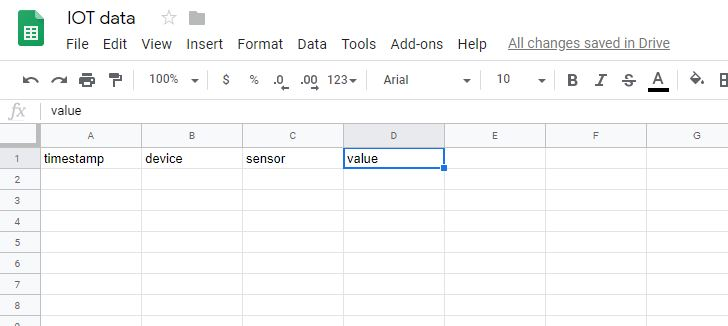
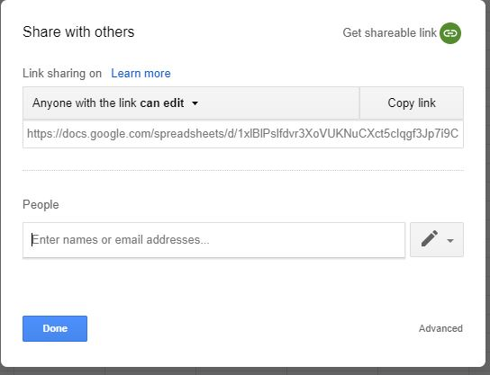
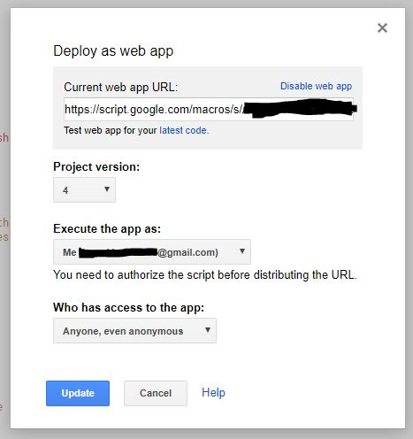

# iot_dashboard_poc
POC to get soil moisture from micro:bit to google sheet to R shiny dashboard

## Setting up a google sheet for data logging

This part is mainly following the [tutorial by Douglas Watson](https://douglas-watson.github.io/post/gdocs_1_gdocs/): I set up a google sheet and a web script, allowing me to push rows of data to the sheet via http. Further, the data can be query for analysis later.

* Create a new google sheet
* Add names to first column: timestap, device, sensor, value

	
	
* Enable read/write access for anyone with link

	
	
* Open the Script editor (Tools/Script editor)
* Add [Code.gs](Code.gs) file to the app (or copy and paste the content into the open file)
* Copy the id of the work sheet from the url of the sheet:
	>  https://docs.google.com/spreadsheets/d/THIS IS THE ID/edit#gid=0
* add it as a  script parameter 'sheetID' under File/Project Properties
* Deploy as web app with the following settings

	

## Deploy shiny dashboard

## micro:bit

### add code for custom blocks

### assemble hardware

### deploy
